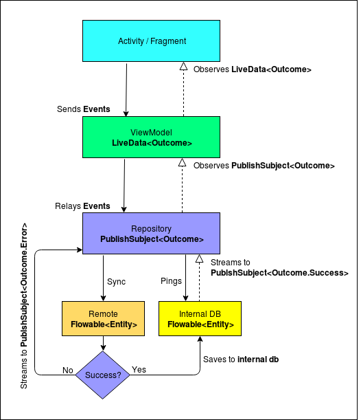

# Posts
A sample app to demonstrate the building of a good, modular and scalable Android app using Kotlin, Android Architecture Components (LiveData, ViewModel & Room), Dagger, RxJava and RxAndroid among others.

# Features
Some of the features of the app include

- **Effective Networking** - Using a combination of Retrofit, Rx, Room and LiveData, we are able to handle networking in the most effective way.

- **Modular** - The app is broken into modules of features and libraries which can be combined to build instant-apps, complete apps or lite version of apps.

- **MVVM architecture** - Using the lifecycle aware viewmodels, the view observes changes in the model / repository.

- **Kotlin** - This app is completely written in Kotlin.

- **Android Architecture Components** - Lifecycle awareness has been achieved using a combination of LiveData, ViewModels and Room.

 - **Offline first architecture** - All the data is first tried to be loaded from the db and then updated from the server. This ensures that the app is usable even in an offline mode.

 - **Intelligent sync** -Intelligent hybrid syncing logic makes sure your Android app does not make repeated calls to the same back-end API for the same data in a particular time period.

 - **Dependency Injection** - Common elements like `context`, `networking` interface are injected using Dagger 2.

 - **Feature based packaging** - This screen-wise / feature-wise packaging makes code really easy to read and debug.

# Working


# Networking


### [Activity](posts/src/main/java/com/karntrehan/posts/list/ListActivity.kt)
```java
viewModel.getPosts()
```

### [ViewModel](posts/src/main/java/com/karntrehan/posts/list/viewmodel/ListViewModel.kt)
```java
fun getPosts() {
    if (postsOutcome.value == null)
        repo.fetchPosts()
}
```

###  [Repository](posts/src/main/java/com/karntrehan/posts/list/model/ListRepository.kt)
```java
val postFetchOutcome: PublishSubject<Outcome<List<PostWithUser>>> = PublishSubject.create<Outcome<List<PostWithUser>>>()

override fun fetchPosts() {
    postFetchOutcome.loading(true)
    //Observe changes to the db
    local.getPostsWithUsers()
            .performOnBackOutOnMain(scheduler)
            .doAfterNext {
                if (Synk.shouldSync(SynkKeys.POSTS_HOME, 2, TimeUnit.HOURS))
                    refreshPosts()
            }
            .subscribe({ retailers ->
                postFetchOutcome.success(retailers)
                }, { error -> handleError(error) })
            .addTo(compositeDisposable)
}

override fun refreshPosts() {
    postFetchOutcome.loading(true)
    Flowable.zip(
            remote.getUsers(),
            remote.getPosts(),
             zipUsersAndPosts()
    )
            .performOnBackOutOnMain(scheduler)
            .updateSynkStatus(key = SynkKeys.POSTS_HOME)
            .subscribe({}, { error -> handleError(error) })
            .addTo(compositeDisposable)
}

private fun zipUsersAndPosts() =
        BiFunction<List<User>, List<Post>, Unit> { users, posts ->
            saveUsersAndPosts(users, posts)
        }

override fun saveUsersAndPosts(users: List<User>, posts: List<Post>) {
    local.saveUsersAndPosts(users, posts)
}

override fun handleError(error: Throwable) {
    postFetchOutcome.failed(error)
}
```

### [ViewModel](posts/src/main/java/com/karntrehan/posts/list/viewmodel/ListViewModel.kt) ###
```java
val postsOutcome: LiveData<Outcome<List<Post>>> by lazy {
    //Convert publish subject to livedata
    repo.postFetchOutcome.toLiveData(compositeDisposable)
}
```

###  [Activity](posts/src/main/java/com/karntrehan/posts/list/ListActivity.kt)
```java
viewModel.postsOutcome.observe(this, Observer<Outcome<List<Post>>> { outcome ->
    when (outcome) {

        is Outcome.Progress -> srlPosts.isRefreshing = outcome.loading

        is Outcome.Success -> {
            Log.d(TAG, "initiateDataListener: Successfully loaded data")
            adapter.setData(outcome.data)
        }

        is Outcome.Failure -> {
            if (outcome.e is IOException)
                Toast.makeText(context, R.string.need_internet_posts, Toast.LENGTH_LONG).show()
            else
                Toast.makeText(context, R.string.failed_post_try_again, Toast.LENGTH_LONG).show()
        }

    }
})
```


# Testing:
To run all the unit tests, run `./gradlew test`. This would test the repositories and the viewmodels.

To run all the instrumented tests, run  `./gradlew connectedAndroidTest`. This would test the LocalDataSources (Room)

# Build info:
  - Android Studio - 3.1 Canary 8
  - Compile SDK - 28
  - MinSDK - 16, Target - 28

# Articles
To read more about the architecture choices and the decisions behind this project, kindly refer to the following articles:
* [Effective Networking On Android using Retrofit, Rx and Architecture Components](https://medium.com/mindorks/effective-networking-on-android-using-retrofit-rx-and-architecture-components-4554ca5b167d)
* [Writing a modular project on Android](https://medium.com/mindorks/writing-a-modular-project-on-android-304f3b09cb37)
* [To Synk or not to Synk](https://medium.com/mindorks/to-synk-or-not-to-synk-fcc6e4c56e14)

**Talk to the developer about this project**: [@karntrehan](https://twitter.com/karntrehan)

# Other samples
Below are some of the other samples I have opensourced: 
* [Starwars](https://github.com/karntrehan/Starwars) : 2019 - A sample modular Android app written in Kotlin using Rx, Koin, Coroutines, Dagger 2 and Architecture components
* [Agni](https://github.com/karntrehan/Agni) : 2019 - Android app template for modular apps with Dagger 2, Coroutines, LiveData, ViewModel and RxJava 2.
* [Talko](https://github.com/karntrehan/Talko) : 2019 - A sample messaging UI app for Android writen in Kotlin with a working local persistence layer.

# Libraries used
* [Android Support Libraries](https://developer.android.com/topic/libraries/support-library/index.html)
* [Dagger 2](https://google.github.io/dagger/)
* [Retrofit](http://square.github.io/retrofit/)
* [OkHttp](http://square.github.io/okhttp/)
* [Picasso](http://square.github.io/picasso/)
* [Stetho](http://facebook.github.io/stetho/)
* [Room](https://developer.android.com/topic/libraries/architecture/room.html)
* [ViewModel](https://developer.android.com/topic/libraries/architecture/viewmodel.html)
* [LiveData](https://developer.android.com/topic/libraries/architecture/livedata.html)
* [RxJava](https://github.com/ReactiveX/RxJava)
* [RxAndroid](https://github.com/ReactiveX/RxAndroid)

# License

    Copyright 2018 Karan Trehan

    Licensed under the Apache License, Version 2.0 (the "License");
    you may not use this file except in compliance with the License.
    You may obtain a copy of the License at

       http://www.apache.org/licenses/LICENSE-2.0

    Unless required by applicable law or agreed to in writing, software
    distributed under the License is distributed on an "AS IS" BASIS,
    WITHOUT WARRANTIES OR CONDITIONS OF ANY KIND, either express or implied.
    See the License for the specific language governing permissions and
    limitations under the License.